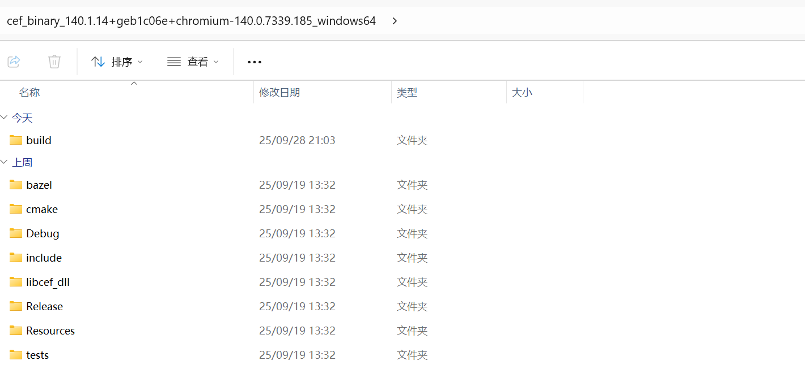

# 使 Qt 集成 Chromium Embedded Framework

Copyright (C) Robert Chen, 2025.

---

## 步骤1. 下载与编译 CEF

1. 转到 [CEF 自动构建](https://cef-builds.spotifycdn.com/index.html)，在 **Current Stable Build** 下选择 Standard Distribution。下载完成之后解压，并于该文件夹下新建目录 **build**：

    

2. 对于 windows x64 的运行环境，请在 **build** 目录下使用命令提示符工具运行：

    ```cmd
    cmake ../CMakeLists.txt -G "Visual Studio 17" -A x64
    ```

    

3. 完成后，在 **build** 目录下得到 CEF 的解决方案**cef.sln**，使用 Visual Studio 2022 打开：

    

4. 在**解决方案资源管理器**中选择项目 **libcef_dll_wrapper** 并作如下配置：

    > 选择**配置属性**-**C/C++**-**运行库**，Debug 模式请将其设置为**多线程调试 DLL（/MDd）**，Release 模式请将其设置为**多线程 DLL（/MD）**

    

5. 在**解决方案资源管理器**中选择项目 **libcef_dll_wrapper**，分别使用 Debug 模式与 Release 模式生成项目。于 ../build/libcef_dll_wrapper 下，可以获取构建的 libcef_dll_wrapper 的二进制文件：

    

---

## 步骤2：Visual Studio 构建 Qt CEF 项目

1. 使用 Visual Studio 2022 创建 Qt Widgets Application，保持默认选项直到项目创建完成：

    

2. 在解决方案目录下，创建目录 **Libs/CEF**，并将 cef_binary_140.1.14 下的 **include**、**Resources** 复制到 **Libs/CEF** 目录下；

3. 在 **Libs/CEF** 目录下创建目录 **bin**，并将 cef_binary_140.1.14 下的 **Debug**、**Release** 复制到 **Libs/CEF/bin** 目录下；

4. 复制 **cef_binary_140.1.14/build/libcef_dll_wrapper** 下的 **Debug** 目录与 **Release** 目录（包含 **libcef_dll_wrapper** 的二进制文件）至 **Libs/CEF/bin** 下；

    

5. 于项目目录下创建 app.manifest：

    ```xml
    <assembly xmlns="urn:schemas-microsoft-com:asm.v1" manifestVersion="1.0">
      <compatibility xmlns="urn:schemas-microsoft-com:compatibility.v1">
        <application>
          <!--The ID below indicates application support for Windows 8.1 -->
          <supportedOS Id="{1f676c76-80e1-4239-95bb-83d0f6d0da78}"/>
          <!-- 10.0 -->
          <supportedOS Id="{8e0f7a12-bfb3-4fe8-b9a5-48fd50a15a9a}"/>
        </application>
      </compatibility>
    </assembly>
    ```

6. 打开 Cactus Reader For PDF，使用 Debug 模式与 Release 模式构建项目，之后在未配置自动复制资源的情况下将： 
    - **Libs/CEF/bin/Debug** 与 **CEF/Resources** 下的文件复制至解决方案的生成目录 **x64/Debug** 下；
    - **Libs/CEF/bin/Release** 与 **CEF/Resources** 下的文件复制至解决方案的生成目录 **x64/Release** 下；

7. Debug 模式下，在 Visual Studio 中执行：调试-开始调试，屏幕上出现应用程序窗口，并被定位至：https://www4.bing.com，则表明项目构建成功：

    

---

由于 Github 的大文件限制策略，存储库内不包含 Chromium Embedded Framework 构建的二进制文件，因此您只需要在 CEF 构建完成后，按照步骤1与步骤2，即可正常调试项目。